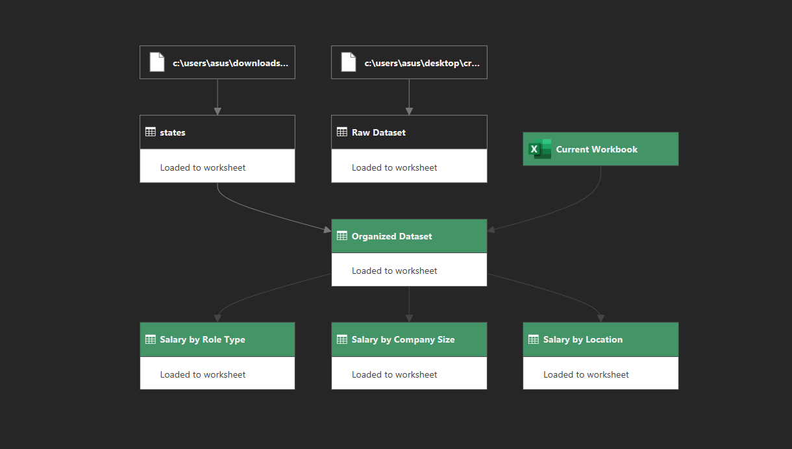

# 📊 Job Posting and Salary Analysis with Power Query

This project demonstrates an end-to-end data cleaning, transformation (ETL), and analysis process using **Excel Power Query** and the **M language**. The raw job posting dataset has been analyzed based on location, company size, and role types to derive meaningful insights.

---

## 🚀 Project Summary and Objective

The primary objective of this project is to process messy **Raw Data**, transform it into an analysis-ready format, and create business intelligence summaries.

The project workflow is as follows:
1.  **Data Cleaning:** Converting the raw data into a standardized format (`Organized Dataset`).
2.  **Data Modeling:** Grouping the cleaned data by different dimensions (Location, Size, Role).
3.  **Reporting:** Summarizing average salaries and job posting counts.

### 🔍 Key Analyses Performed
* 📍 **Salary by Location:** Salary distributions based on states and regions.
* 🏢 **Salary by Company Size:** The effect of company size (number of employees) on salaries.
* 💼 **Salary by Role Type:** Income analysis based on job titles and role categories.

---

## 📂 Project Files and Contents

The functions of the files within the repository are described below:

* **`Power Query Analyze Project 1.xlsx`**: The main project file. It contains the *Raw Dataset*, *Organized Dataset*, *States* tables, and all generated *Salary* summary tables.
* **`Dependencies.png`**: A diagram showing the flow and dependencies of the queries.
* **M Script Files (`.m`):**
    * `Organized Dataset.m`: The main transformation script that cleans raw data.
    * `Salary by Location.m`: The algorithm for grouping data by location.
    * `Salary by Company Size.m`: The script for analysis based on company size.
    * `Salary by Role Type.m`: The script for calculating salaries by role type.

---

## 🔗 Query Dependencies

In this project, queries are linked in a chain structure. The data flow diagram from raw data to final reports is shown below:

---

## 🛠 How to Use

1.  Download the **`Power Query Analyze Project 1.xlsx`** file to your computer.
2.  Open the file in Excel and go to the **Data** tab.
3.  Open the **Queries & Connections** pane to view the data transformation steps on the right side.
4.  You can right-click on any query and select **Advanced Editor** to examine the `.m` codes and logic.

---
*This project was created to demonstrate data analytics and ETL skills.*
